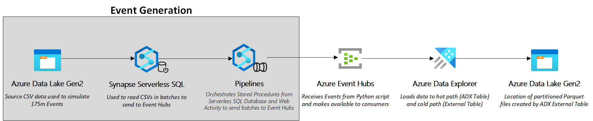
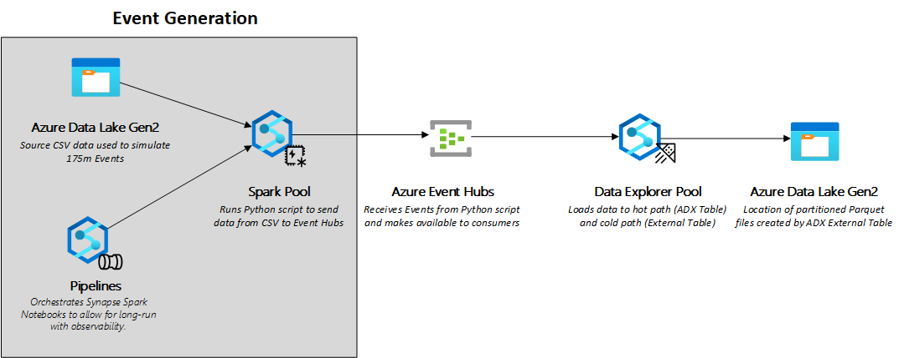

# Azure Data Explorer - Simple Lamda Architecture

## Repository Summary
This Proof of Concept is meant to demonstrate how Azure Data Explorer (ADX) can be used to continuously ingest a Azure Event Hubs stream to a raw table, a cleaned table, and finally to partitioned Parquet files on Azure Data Lake Storage. The idea behind this concept is this will give you a hot path in the ADX clean table and a cool path (and archive!) in the partitioned Parquet files.

## Pre-requisites 
1) A sandbox Azure Resource Group where the deploying user has Contributor access. [More Info Here](https://learn.microsoft.com/en-us/azure/role-based-access-control/overview#role-assignments)
2) The necessary Resource Providers for Synapse, Event Hubs, Key Vault, and Storage Accounts. [More Info Here](https://learn.microsoft.com/en-us/azure/azure-resource-manager/management/resource-providers-and-types)
3) Access to a means to deploy Bicep scripts. [Visual Studio Code](https://learn.microsoft.com/en-us/azure/azure-resource-manager/bicep/deploy-vscode) works well to iteratively work through the needed parameters in the event of a a deployment failure. [CLI](https://learn.microsoft.com/en-us/azure/azure-resource-manager/bicep/deploy-cli), [Powershell](https://learn.microsoft.com/en-us/azure/azure-resource-manager/bicep/deploy-powershell), and [Azure Cloud Shell](https://learn.microsoft.com/en-us/azure/azure-resource-manager/bicep/deploy-cloud-shell?tabs=azure-cli) are other options.

## Deployment Options
### Deployment Options Summary 

Azure is all about optionality. This use case supports two options to demonstrate this virtue. The Serverless Event Sender options requires less architecture to support the Proof of Concept and is potentially a bit cheaper to run. The Python Event Sender option shows that the Spark pool can also be used to run small Python applications and is a bit faster at sending events. 

### Important Note on Deployment Options ###

The Event Generation portion of these architectures are meant to simulate a production streaming workload. You can learn interesting things about the interaction of Synapse Pipelines, Serverless SQL Pools, and Spark pools in these examples but in production you'll likely see a different streaming source sending data to Azure Event Hubs. 

### Resources Shared by both Deployment Types ###
1) __Azure Data Lake Gen 2 (Source)__ - Uploading the NYC Taxi Fare Source CSVs to the Azure Data Lake enables the Event Senders to "event-ize" the CSV data and send to Azure Event Hubs
2) __Azure Event Hubs__ - Event Hubs is used to integrate the NYC Taxi Fare data stream into other big data services. In our case, we are integrating with Azure Data Explorer but there are a vast amount of native integrations to Event Hubs in the Azure ecosystem. __In a production scenario, this would be the origin of your data.__
3) __Azure Data Lake Gen 2 (Destination)__ - This is where the partitioned Parquet files will land via the External Table and Continuous Export features in Azure Data Explorer. This could represent the "cool path" data to be used in long running queries in other compute engines used for advanced analytics.
4) __Azure Synapse Pipelines__ - Pipelines are used to orchestrate both the Serverless SQL and the Python Notebook deployment options. This allows for scheduling and monitoring of those processes as well.

### Deployment Option 1: Serverless Event Sender

_Components Unique to Deployment Option 1_
1) __Synapse Serverless SQL__ - The Serverless SQL Pool is used to query the CSV as it resides on the Azure Data Lake Account. The queries used will inventory the files, add a row identifier to the file, and use the row identifier to form batches to send to Azure Event Hubs. 
2) __Azure Data Explorer__ - The Standalone Azure Data Explorer service is used in this Deployment Option to show another pattern that can be employed. Synapse Data Explorer Pools do not have the VM SKU options the standalone service does so there are use cases where the Standalone service may be required. 
   
### Deployment Option 2: Python Event Sender

_Components Unique to Deployment Option 2_

1) __Spark Pool__ - There were two motivations to use a Spark pool to illustrate this use case. First, it is easy to deploy as part of a Synapse Deployment. Second, it can run vanilla Python code which allows us to simulate event generation. __In this example, the Spark pool is not used to perform normal Spark workloads.__ You could move the Python code used in the notebook to another deployment mechanism (Azure App Services, Functions, Kubernetes, VM etc) and get the same result. 
2) __Synapse Azure Data Explorer__ - ADX provides both hot and cool path processing of the Event Hubs streaming data used in this example. To ease deployment, the Synapse ADX Pool is used. __Synapse ADX is still in Public Preview. If you need more flexibility in VM SKUs or more fulsome features use the standalone Azure Data Explorer Service.__

## Steps to Deploy

__[Deployment Option 1: Serverless](./docs/serverless/README.md)__

__[Deployment Option 2: Python](./docs/python/README.MD)__
