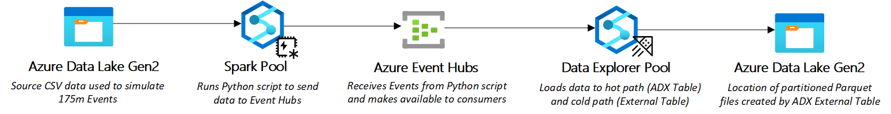

# Azure Synapse Data Explorer - Simple Lamda Architecture

## Summary
This project is meant to demonstrate how Azure Data Explorer (ADX) can be used to continuously ingest a Azure Event Hubs stream to a raw table, a cleaned table, and finally to partitioned Parquet files on Azure Data Lake Storage. The idea behind this concept is this will give you a hot path in the ADX clean table and a cool path (and archive!) in the partitioned Parquet files.

## Simplified Architecture

## Pre-requisites 
1) A sandbox Azure Resource Group where the deploying user has Contributor access. [More Info Here](https://learn.microsoft.com/en-us/azure/role-based-access-control/overview#role-assignments)
2) The necessary Resource Providers for Synapse, Event Hubs, Key Vault, and Storage Accounts. [More Info Here](https://learn.microsoft.com/en-us/azure/azure-resource-manager/management/resource-providers-and-types)
3) Access to a means to deploy Bicep scripts. [Visual Studio Code](https://learn.microsoft.com/en-us/azure/azure-resource-manager/bicep/deploy-vscode) works well to iteratively work through the needed parameters in the event of a a deployment failure. [CLI](https://learn.microsoft.com/en-us/azure/azure-resource-manager/bicep/deploy-cli), [Powershell](https://learn.microsoft.com/en-us/azure/azure-resource-manager/bicep/deploy-powershell), and [Azure Cloud Shell](https://learn.microsoft.com/en-us/azure/azure-resource-manager/bicep/deploy-cloud-shell?tabs=azure-cli) are other options.

## Steps to Create
1) [Clone this repository into Visual Studio Code](https://learn.microsoft.com/en-us/azure/developer/javascript/how-to/with-visual-studio-code/clone-github-repository?tabs=create-repo-command-palette%2Cinitialize-repo-activity-bar%2Ccreate-branch-command-palette%2Ccommit-changes-command-palette%2Cpush-command-palette)
2) [Deploy resources to Resource Group](./docs/deploy.md)
3) Grant permissions to allow services to work together.
4) Set up and test Spark data generator.
5) Set up and test Data Explorer ingestion.
6) Set up and test Data Explorer continuous partitioned export.