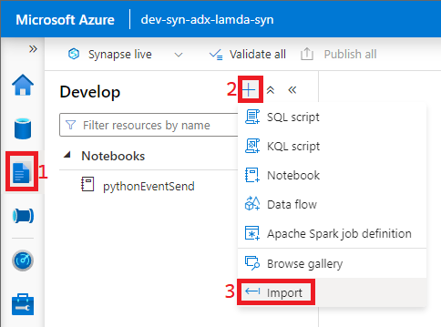
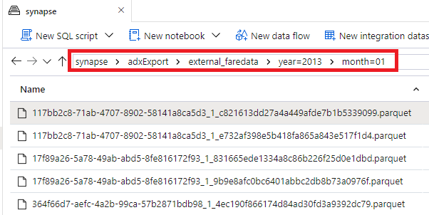

## Ingest data into 
### Summary
This walkthrough is to demonstrate how to set up a continuous export from a Azure Data Explorer table to a partitioned Parquet table in Azure Data Lake.

### Steps
#### __Set up the Continuous Export__
1) Import the [01 - cleanTableCreate kql](../code/kusto/01%20-%20cleanTableCreate.kql) script from this repository into Synapse Studio by following the below steps.

    

2) Run each command against the nyctaxi database individually. Learn about the [stored function](https://learn.microsoft.com/en-us/azure/data-explorer/kusto/management/create-function) and [update policy](https://learn.microsoft.com/en-us/azure/data-explorer/kusto/management/updatepolicy) being applied.
3) Repeat the process detailed in Step #1 to import the [02 - externalTableCreate](../code/kusto/02%20-%20externalTableCreate.kql) script.
4) Run each command in this script individually while learning about the [Managed Identity policy](https://learn.microsoft.com/en-us/azure/data-explorer/kusto/management/managed-identity-policy), [External tables](https://learn.microsoft.com/en-us/azure/data-explorer/kusto/query/schema-entities/externaltables), and [Continuous data export](https://learn.microsoft.com/en-us/azure/data-explorer/kusto/management/data-export/continuous-data-export).

#### __Run Large Files to create partitioned Parquet tables__
1) Download the 2013 NYC Taxi files named trip_fare_number.zip from the [University of Illinois Box Account](https://uofi.app.box.com/v/NYCtaxidata/folder/2332219935).
2) Unzip the files and upload the raw CSVs contained in them to the raw/faredata. There are 3 possible paths to upload these CSVs.
   
   1) Use the path for uploading outlined in the [Event Sender](./eventSender.md) guide. (Upload Sample Data section). This method can be slower than the alternatives.
   2) Download and install the [Azure Storage Explorer](https://azure.microsoft.com/en-us/products/storage/storage-explorer/#overview) tool and login with your Azure credentials to upload. This is fast and has a GUI to simplify uploading.
   3) Configure and use [azcopy](https://learn.microsoft.com/en-us/azure/storage/common/storage-ref-azcopy-copy). This will take more legwork but can be used in a repeatable fashion.

3) Now you can trigger the pipeline as referenced in the [Event Sender](./eventSender.md) example or you can just re-run the pipeline with the same parameters as referenced in the [ADX Ingestion](adxIngest.md) step. 
   

#### __Final Information__
This will take nearly 24 hours and you should wind up with files in your synapse storage container under the adxExport/external_faredata/year=yyyy/month=mm directory (example below). Since these files are partitioned they should be performant when querying or transforming downstream.

