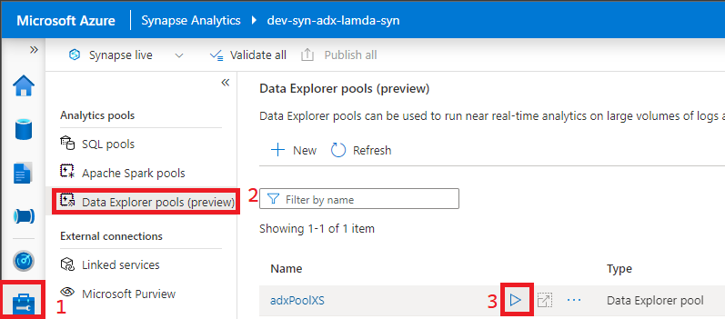
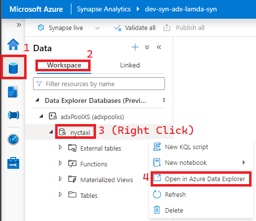
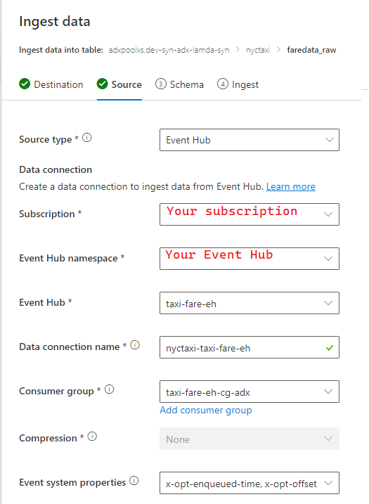
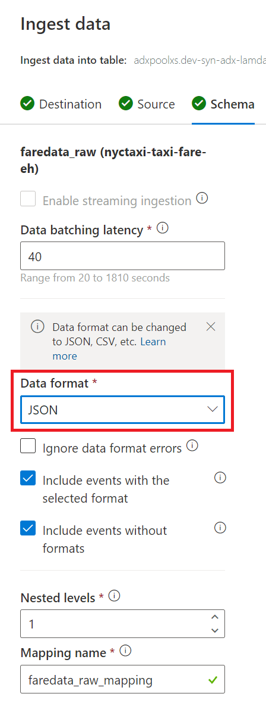
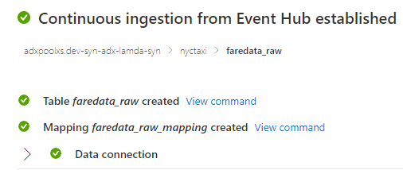
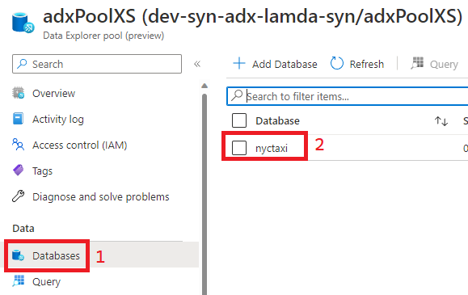
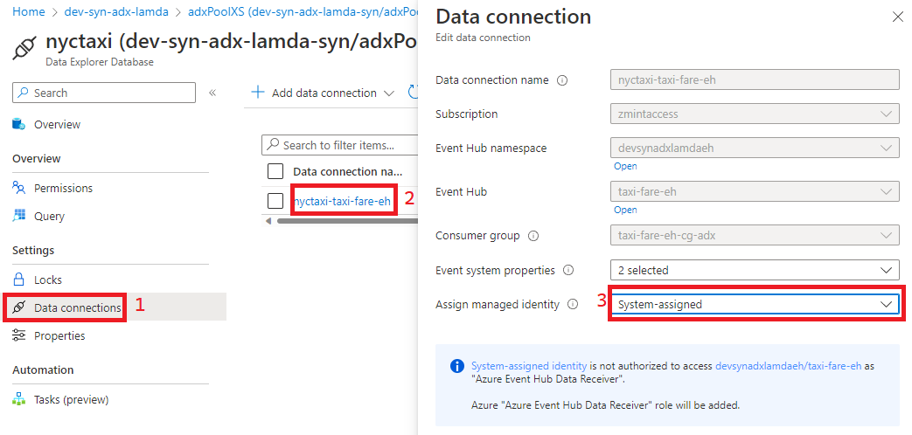
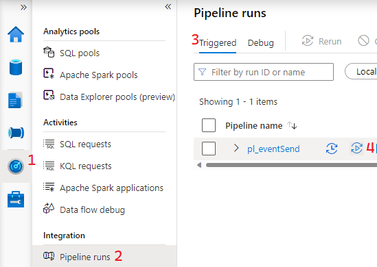
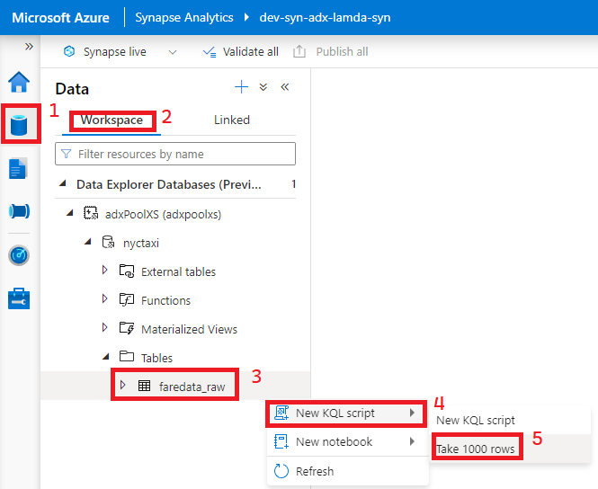

## Ingest data into Azure Data Explorer
### Summary
This walkthrough is to demonstrate how to set up ingestion into an Azure Data Explorer database and table from Azure Event Hubs.

### Steps
#### __Set up Ingestion__
1) Start in Synapse Studio by ensuring your Data Explorer Pool is online. If it is paused, resume it by following the steps below.

    

2) Once your pool is online open up your database in Azure Data Explorer. A quick shortcut to that can be found in following the below path in Synapse Studio.

    

3) In the Azure Data Explorer studio, right click the database associated with your Synapse Workspace called nyctaxi and select "Ingest Data"
4) On the "Destination" tab on the Ingest wizard your Cluster and Database will already be selected. Choose to ingest to a new table called faredata_raw
5) Fill out the source screen by following the screenshot below. The Event System Properties selected are x-opt-enqueued-time and x-opt-offset.

    

6) Fill out the schema screen by following the screenshot below and move to the next screen. ___Note: If Sample Data cannot be found for this screen, simply re-run the pipeline you created in [the previous step](./eventSender.md)___ 

    

7) Ensure all is well by reviewing the results. If you get an error here follow the directions on [this page](./adxIngestError.md) to resolve.

    

8) Go to the Data Explorer Pool resource in the Azure Portal and open the nyctaxi database.

    

9) Then go to Data connections, choose nyc-taxi-fare-eh, and use the System-Assinged value in the Assign managed identity option. Click update and wait for notification verifying update succeeded. This will allow Data Explorer to read events from Event Hub in the event of a key rotation.

    

#### __Test Ingestion__
1) Re-run the pl_eventsend pipeline set up in this step. An easy way to do this with the same parameters is to rerun from the Monitor Tab in Synapse Studio.
   
    

2) Once the pipeline has completed, Check that there's data in your faredata_raw table by going to the Data tab in Synapse Studio and getting the Top 1000 rows.

    

3) Additionally, you can run the below KQL query to assert whether all rows loaded into the ADX table. (Should have 7031 rows)

    ```
    ['faredata_raw']
    | count
    ```

