## Add Event Hub Connection String to Key Vault
### Summary
Use VS Code to deploy resources to sandbox Resource Group.

### Steps
#### __Add Notebook__
1) Open Synapse Studio through the Azure Portal
2) Go to the Develop Tab and click the "+" button to add a new artifact. Choose the Import option from this menu.

    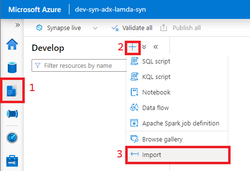

3) When the file browser opens, choose the [nb_pythonEventSend.ipynb](../code/notebook/nb_pythonEventSend.ipynb) file contained in this repository. 
4) Your notebook should be available in the Develop tab now.

#### __Add Pipeline__
1) In Synapse Studio go to the Integrate tab and click the "+" button. Choose the Import option from this menu.

    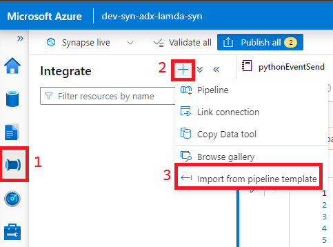

2) When the file browser opens, choose the [pl_eventSend.zip](../code/pipeline/pl_eventSend.zip) file contained in this repository.
3) Click the Open Pipeline button to add it into the workspace
4) In the open pipeline, select the notebook activity in the design canvas and navigate to the settings menu. Set the settings as shown below and click the Validate button

    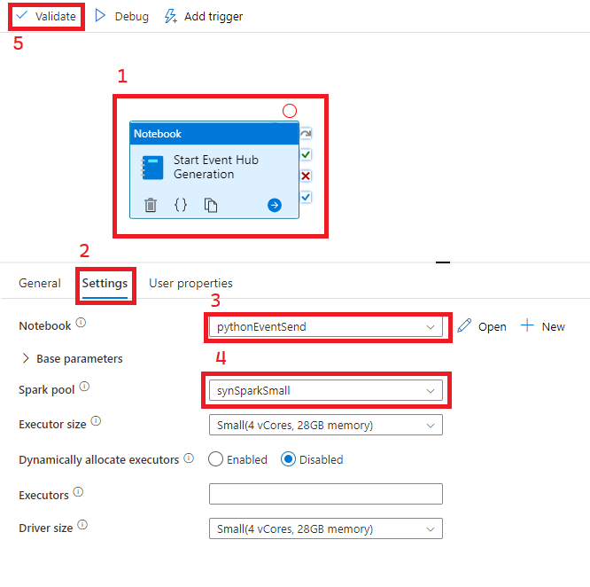
   
#### __Publish Artifacts__
1) Now that you've added a pipeline and a notebook to your workspace click the "Publish All" button to persist them to your workspace. (The number of changes you're publishing will likely say 2...not 4)

    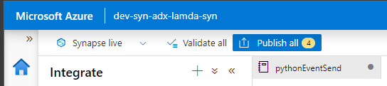

2) Ensure your publish has succeeded by checking your notifications in the upper right corner of the screen.

    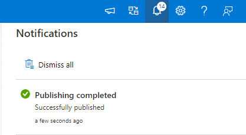

#### Upload Sample Data
1) Go to the Data tab in Synapse Studios and Select the Linked storage for your workspace Storage Account. Open the Synapse Container.

    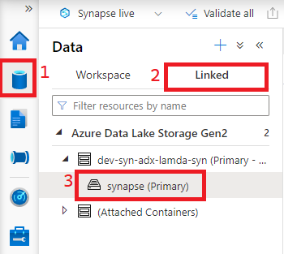

2) In the file browser click the button to add a new folder called "raw". Go into to that directory and create a subfolder called "faredata".
   
    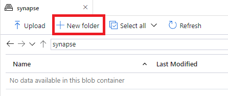

3) Navigate to the "faredata" folder you just created and click the Upload button and upload the [sample.csv](../data/sample.csv) file from this repo.
4) __BONUS:__ If you'd like to see data contained in the sample file you can leverage the Serverless SQL Pool in your Synapse Workspace by right clicking the CSV you just uploaded.

    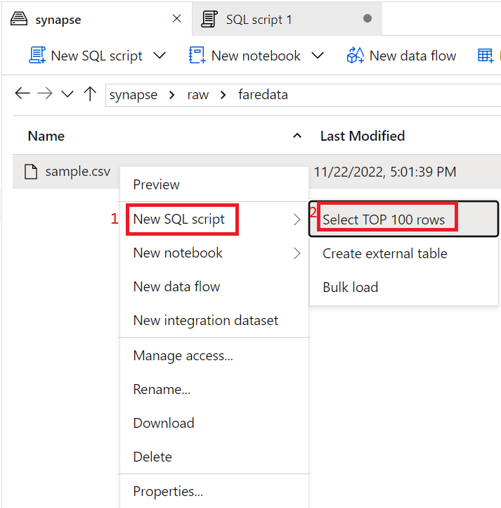

#### Test Event Hub Upload
1) Return to the Integrate tab and the Pipeline you added earlier in this process.
2) Click on "Add Trigger" and then "Trigger Now"

    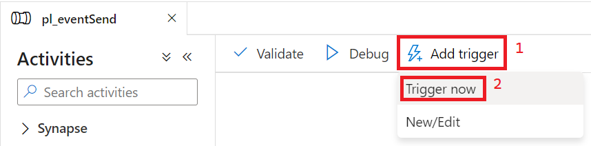

3) This will bring up a list of parameters to fill in. I reccomend opening up another browser window, locating all of these parameters, and copying them into a notepad so you can re-use them later.

Parameter | Value
-----------|----------
storageAccountName | Open the Azure Data Lake Linked Service. Examine the url and take the portion between "https://" and "dfs"
storageAccountContainer | The value for this parameter is synapse
storageAccountDirectory | The value for this parameter is raw/faredata which is the directory we created earlier.
storageAccountLinkedServiceName | This will be the name of the Linked Service you opened to get the storageAccountName parameter. Will be postfixed by WorkspaceDefaultStorage
keyVaultName |  Open the Azure Key Vault Linked Service. Examine the url and copy the portion between "https://" and "vault"
keyVaultLinkedServiceName | ls_keyvault
keyVaultEventHubConnStr | This will be the name of the secret stored in [this walkthrough](eventHubConnStringKV.md) (eh-taxifare-ConnStr if you're setting it up exactly like the screenshots)
eventHubName | taxi-fare-eh

4) To check your Pipeline Status go to the Monitor tab as shown below and watch it. Cluster warm up for Spark can take a few minutes so it will likely run for at least 5 minutes.

    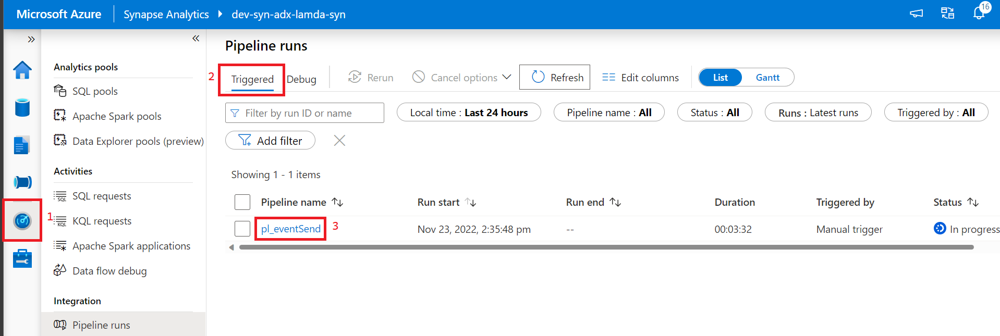

5) If your pipeline succeeds, go to the Event Hub resource in the Azure Portal. In the resource overview you should be able to see messages flowing through to your Event Hub by looking at the graphs that look like those below.

    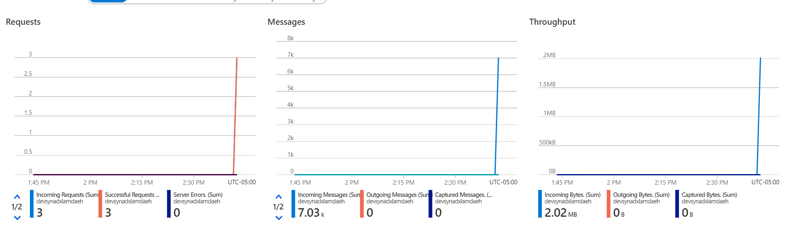