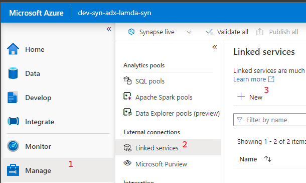
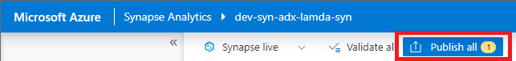

## Create Event Sender Using Synapse Serverless SQL Pool and Synapse Pipelines. 

### Summary
This is an alternative event sending methodology that doesn't require the provision and use of the Synapse Spark Pool. 

### Steps 
#### Set up Serverless SQL Database and Linked Service
1) Open Synapse Studio and Create a Serverless SQL Database.
   
2) Select Serverless for SQL pool type, name the database nyctaxi, and click Create.
3) Examine the Synapse SQL Pool to collect some details.
    
4) In the Serverless Pool Details copy the Serverless endpoint to a notepad for later use.
    
5) Set up a new Linked Service.
    
6) Search for Azure Synapse Analytics and click Continue.
7) Name the service ls_ServerlessSQL and fill in the rest of the fields as they are below. Make sure to copy the endpoint address copied in step 4 to the Fully qualified domain name field. Test the connection and save if successful.
    
8) Publish your Linked Service in preparation for next steps.
        

#### Set up Stored Procedures. 
1) 