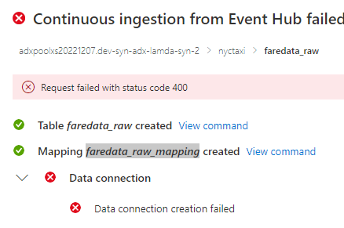
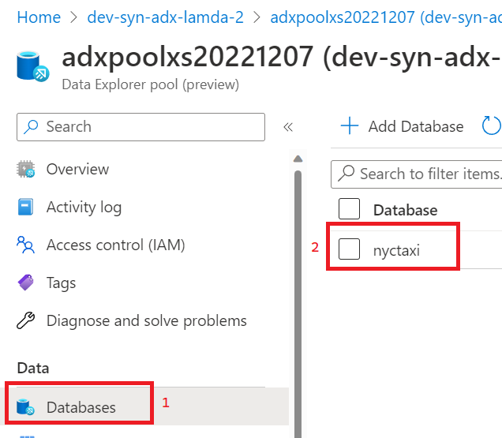
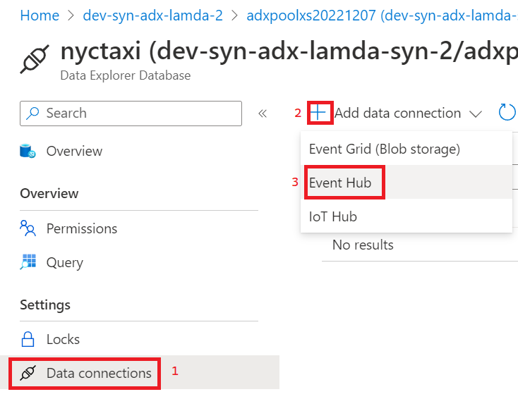
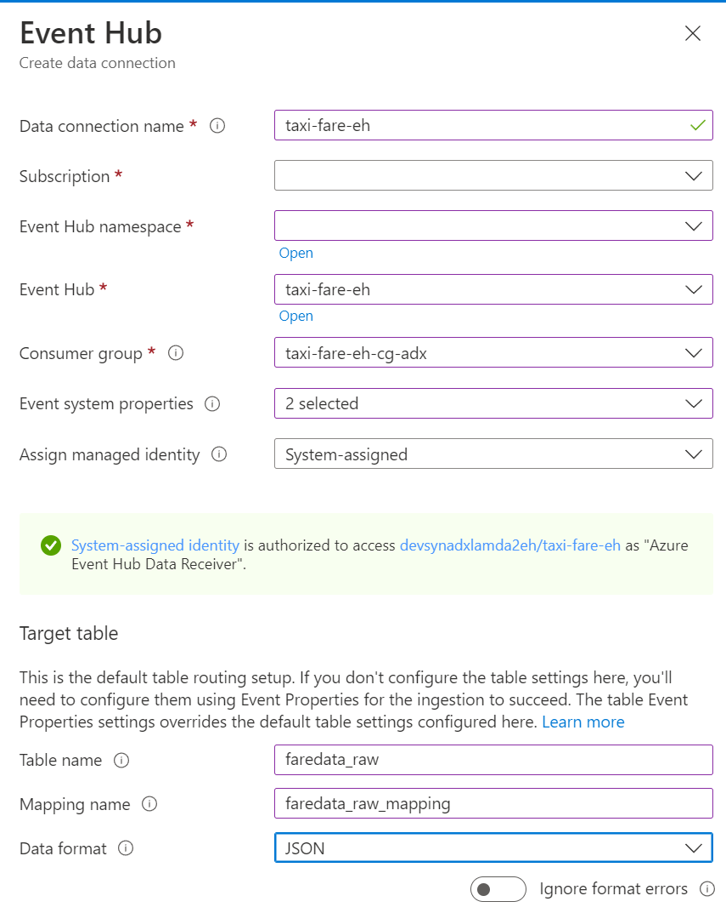

## ADX Ingest Error Remediation
### Summary
If you experience the below error then follow the steps below to attempt to remediate.

### Summary
1) Find the Synapse ADX Cluster in the Azure Portal and navigate to the nyctaxi database.
    
    

2) Go to the Data connections for the database and add a connection for Event Hub.
    
    

3) Enter the information in the screen below with your Subscription and Event Hub namespace. The two selected Event system properties are x-opt-enqueued-time and x-opt-offset.
    
    
    