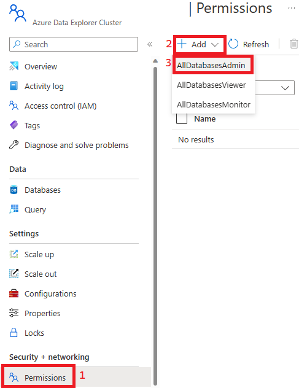

## Add AllDatabasesAdmin Access to Azure Data Explorer

### Summary
This step sets you up with the All Databases Admin role in Azure Data Explorer. This will be necessary to allow your user to set up what the Data Explorer Managed Identity can see and do. [More Info Here](https://learn.microsoft.com/en-us/azure/data-explorer/kusto/management/access-control/role-based-authorization)

### Steps 
1) Go to the Data Explorer resource in Azure Portal and add a new permission. 

    

2) Find your user, click it, and click Select 
