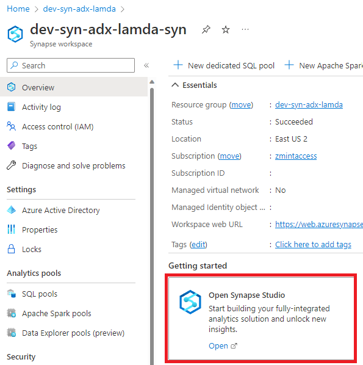
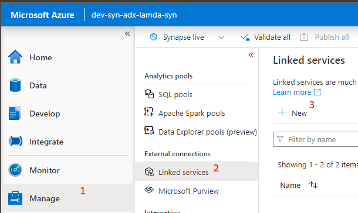
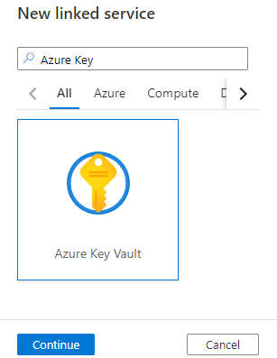
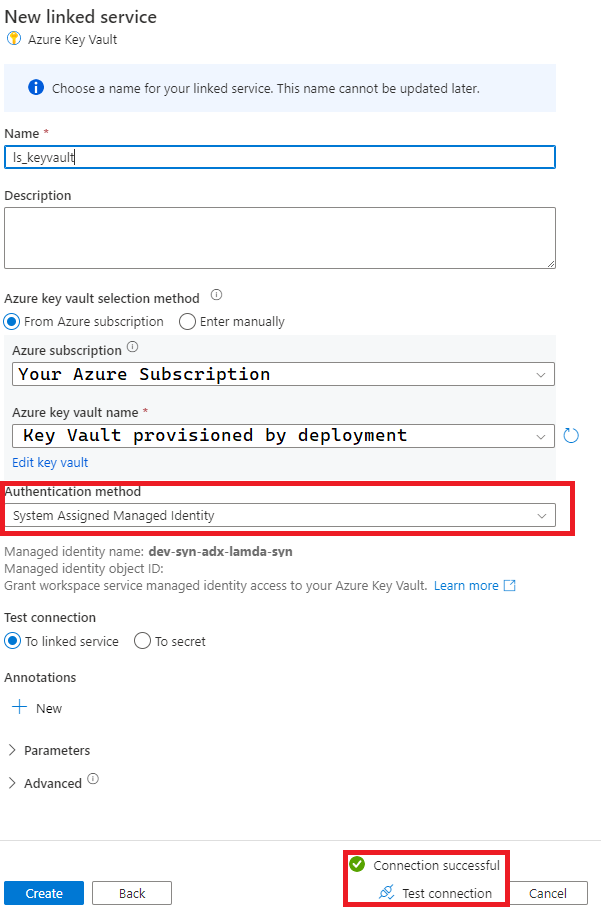
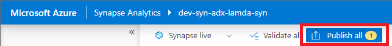

## Add Key Vault Linked Service to Synapse
### Summary
Open Synapse Studio in the Azure Portal and [create a Linked Service to Azure Key Vault](https://learn.microsoft.com/en-us/azure/data-factory/store-credentials-in-key-vault).

### Steps 
1) To open Synapse Studio go to the Synapse Resource in the portal an click the button below.

2) On the left side of the screen you'll see an Icon representing the Manage blade of Synapse Studio Click it and find Linked Services. Click the New button

3) Search for Azure Key Vault and click Continue

4) Complete the screen below, test connection, and Create.

5) Publish your Changes
