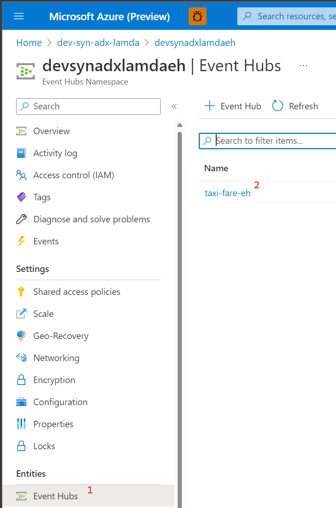
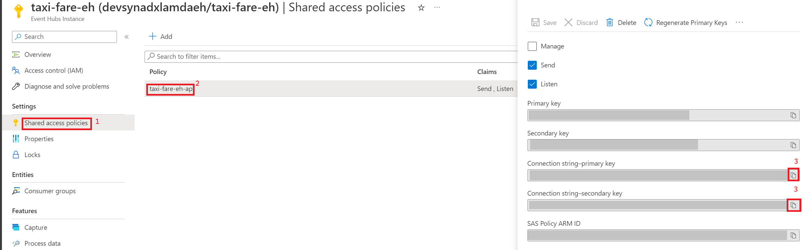
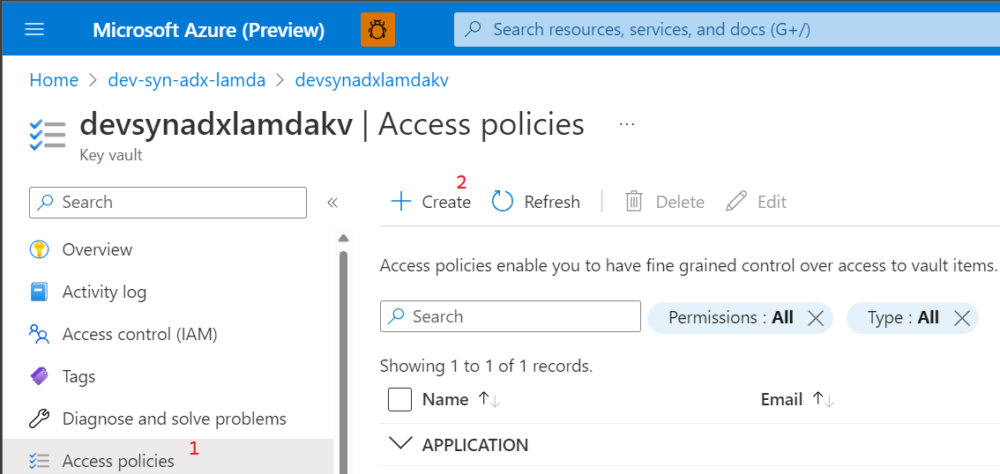
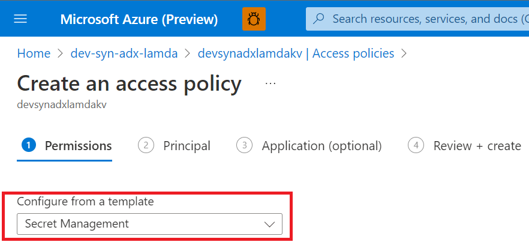
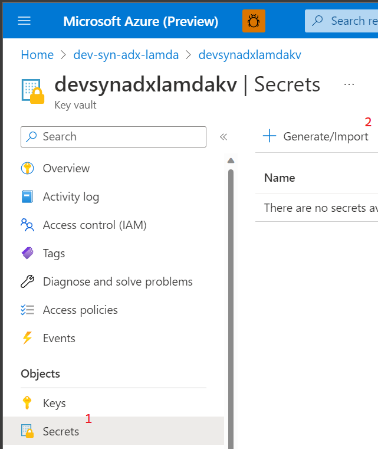
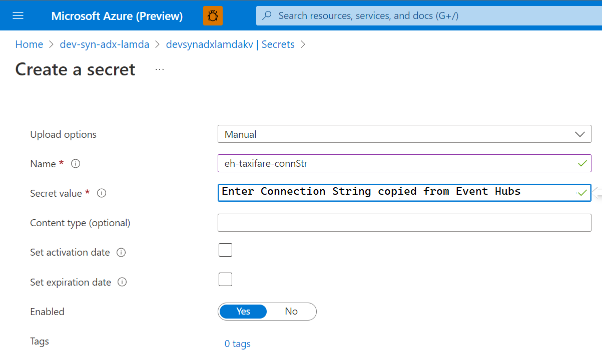

## Add Event Hub Connection String to Key Vault
### Summary
In this tutorial we'll [add a secret](https://learn.microsoft.com/en-us/azure/key-vault/secrets/quick-create-portal#add-a-secret-to-key-vault) to Azure Key Vault containing the [Event Hub Connection String](https://learn.microsoft.com/en-us/azure/event-hubs/event-hubs-get-connection-string#connection-string-for-a-specific-event-hub-in-a-namespace).

### Steps
1) Go to the Azure Portal and the Event Hub resource created for this lab.
2) Click on Event Hubs menu item in the left blade and open up the specific Event Hub we'll be sending events to. (Illustrated below)

    

3) Copy the Event Hub connection string temporarily to a safe place by following the navigation path below. You can use either the primary or secondary key in this exercise.

    

4) Return to the portal and open up the Azure Key Vault resource created for this lab.
5) Navigate to the path below.

    

6) Through the subsequent screens give your AAD user permissions to administer secrets by selecting the below template.

    

7) Now that your user has the ability to create secrets follow the below navigation path to create one.

    

8) On this screen take the connection string copied in Step 3 and copy it into the field as shown below. If you saved it in a notepad, delete it now that you've copied it into Key Vault. Seriously. _I'm watching you._

    
