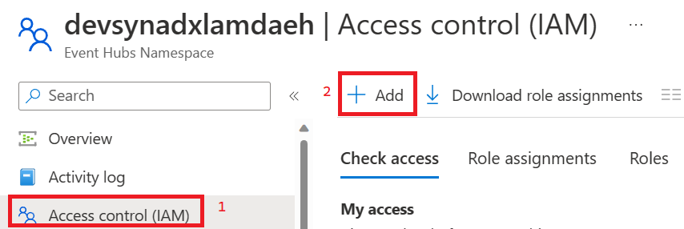
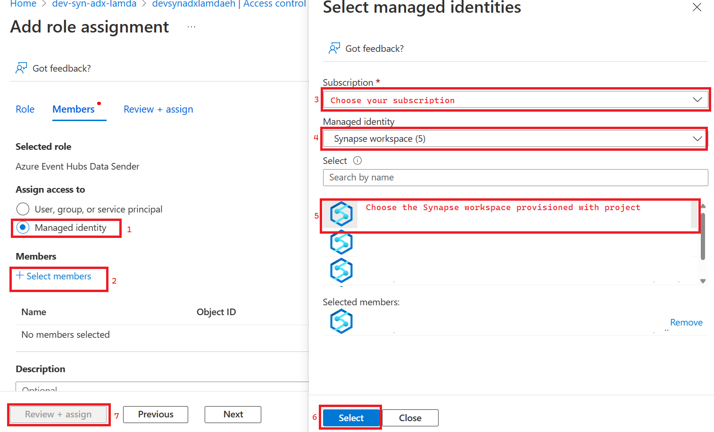
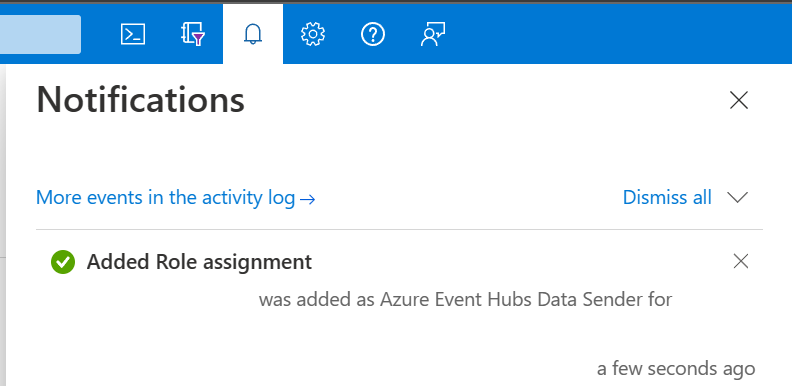

## Give Synapse the ability to send events to Event Hub

### Summary
This step sets up the required RBAC Role in Event Hubs to allow the Synapse Managed Identity to send events

### Steps
1) Go to the Azure Portal resource for the Event Hubs instance created in deployment.
2) Open up Access Control (IAM) and click Add
    
    

3) Search for Event Hubs Data Sender and click Next.
4) Follow the steps below to add your Synapse workspace as a Event Hubs Data Sender.
    
    

5) Finalize on the subsequent screen. Watch your Azure notifications to ensure that the role has been created.
    
    