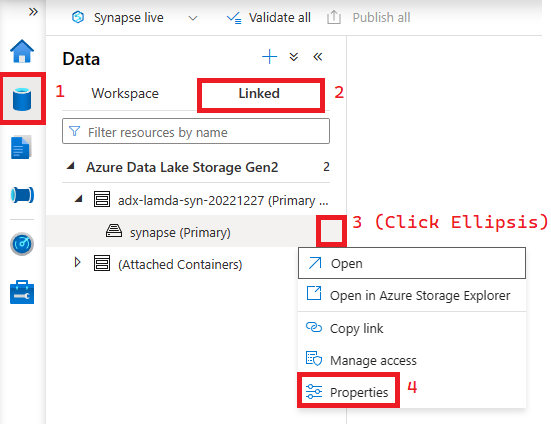
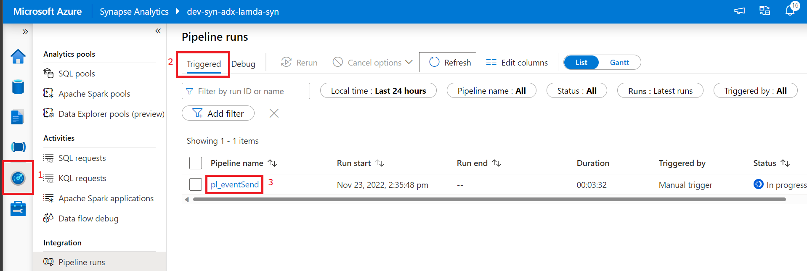

## Create Event Sender Using Synapse Serverless SQL Pool and Synapse Pipelines. 

### Summary
This is an alternative event sending methodology that doesn't require the provision and use of the Synapse Spark Pool. 

### Steps 
#### Upload Sample Data
1) Go to the Data tab in Synapse Studios and Select the Linked storage for your workspace Storage Account. Open the container created with your storage account (in the screenshot it's called "synapse").

    

2) In the file browser click the button to add a new folder called "raw". Go into to that directory and create a subfolder called "faredata".
   
    

3) Navigate to the "faredata" folder you just created and click the Upload button and upload the [sample.csv](../../data/sample.csv) file from this repo.
4) __BONUS:__ If you'd like to see data contained in the sample file you can leverage the Serverless SQL Pool in your Synapse Workspace by right clicking the CSV you just uploaded.

    

#### Create supporting Stored Procedures
1) There are several ways to add these stored procedures to the Serverless SQL Pool but I'm going to focus on a simple/methodical way to do so. 
2) Open Synapse Studio and follow the steps below to create a query window running against the nyctaxi Serverless SQL DB.
   
    

3) Copy and paste the contents of [00 - createSourceAndFormat.sql](../../code/serverless/00%20-%20createSourceAndFormat.sql) into the open query window. Follow the instructions in the script to modify and run each command seperately to ensure they run without error. A quick way to look up the storage account name and container is below. 

    

4) Scripts [01](../../code/serverless/01%20-%20createGetFilesProcedure.sql), [02](../../code/serverless/02%20-%20createFileInProcessProcedure.sql), [03](../../code/serverless/03%20-%20createGetBatchesProcedure.sql), and [04](../../code/serverless/04%20-%20createRetreiveEventHubBatchProcedure.sql) can be pasted in and ran individually without any modifications. 
5) Use script [05](../../code/serverless/05%20-%20testProcedures.sql) script to check your work by following the steps in the comments.

#### Orchestrate Stored Procedures with Synapse Pipelines
1) In Synape Studio, import a pipeline by following the steps below.
    
    
    
2) Select the [pl_Serverless_EventSend.zip](../../code/serverless/../pipeline/pl_Serverless_EventSend.zip) file from this repository.
3) When prompted to choose a linked service select ls_serverlesSQL and click Open Pipeline to import the pipelines from the zip.
   
   

4) Click the Publish All button to deploy the Pipelines and make them available to Trigger. 
   
      

#### Test Event Hub Upload
1) Return to the Integrate tab and open the the pl_Serverless_00_runFiles Pipeline you added earlier in this process.
2) Click on "Add Trigger" and then "Trigger Now"

    

3) This will bring up a list of parameters to fill in. I reccomend opening up another browser window, locating all of these parameters, and copying them into a notepad so you can re-use them later.

    Parameter | Value
    -----------|----------
    storageAccountName | Open the Azure Data Lake Linked Service. Examine the url and take the portion between "https://" and "dfs"
    faredatapath | container/raw/faredata/ (Replace container with the Storage Account container defined in deployment)
    eventHubName | taxi-fare-eh
    eventHubNamespaceName | The name of the Event Hub namespace provisioned during deployment. 

4) Click OK to run the pipeline. 
5) To check your Pipeline Status go to the Monitor tab as shown below and watch it. 

    

6) If your pipeline succeeds, go to the Event Hub resource in the Azure Portal. In the resource overview you should be able to see messages flowing through to your Event Hub by looking at the graphs that look like those below. (If nothing shows up immediately in the charts, give it a couple of minutes before panicking.)

    