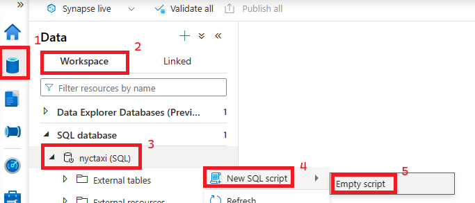

## Set up Serverless SQL Database and Linked Service

### Summary
This prepares your Synapse Serverless SQL Database to be used as a a source in Synapse Pipelines. 

### Set up Serverless SQL Database and Linked Service
1) Open Synapse Studio and Create a Serverless SQL Database.
   
   

2) Select Serverless for SQL pool type, name the database nyctaxi, and click Create.
3) Now that the database is created open up a query window in the database by following the screenshot below.

    

4) Paste the below statement into the query window and run it. This will allow for the best performance against our base data set as all the characters are from Western collation. More on this [here](https://techcommunity.microsoft.com/t5/azure-synapse-analytics-blog/always-use-utf-8-collations-to-read-utf-8-text-in-serverless-sql/ba-p/1883633)

    ```
    ALTER DATABASE nyctaxi COLLATE Latin1_General_100_BIN2_UTF8;
    ```

5) Examine the Synapse SQL Pool to collect some details.
    
    

6) In the Serverless Pool Details copy the Serverless endpoint to a notepad for later use.
    
    

7) Set up a new Linked Service.
    
    

8) Search for Azure Synapse Analytics and click Continue.
9)  Name the service ls_ServerlessSQL and fill in the rest of the fields as they are below. Make sure to copy the endpoint address copied in step 4 to the Fully qualified domain name field. Test the connection and save if successful.
    
    

10) Publish your Linked Service in preparation for next steps.
    
    