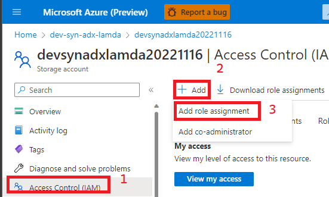
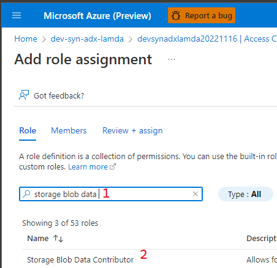
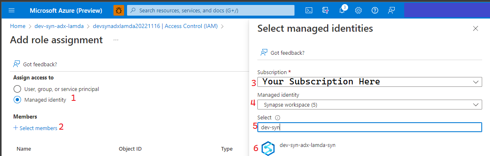
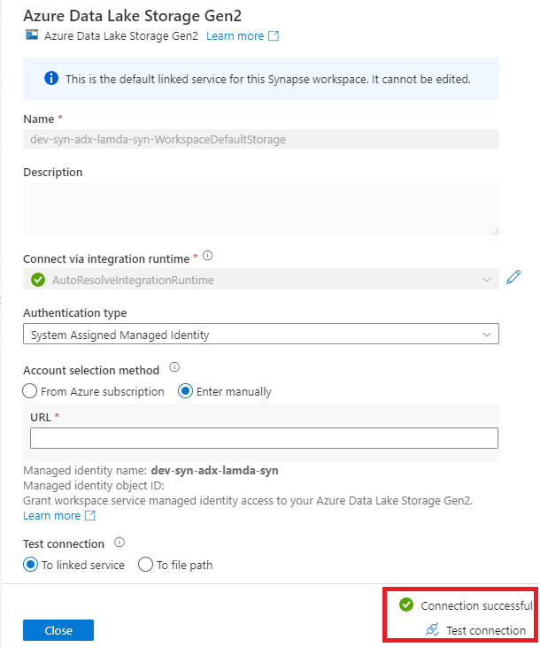

## Add Event Hub Connection String to Key Vault
### Summary
In this tutorial we'll give our Synapse Workspace Managed Identity and Azure Active Directory User Account the Storage Blob Data Contributor role. This will allow us to read and write from the storage account. _(You would not normally give a user this level of access on a permanent basis. This is specifically for ease of execution in this lab.)_

### Steps
1) Go to the Azure Portal and the Storage Account resource created for this lab. 
2) Go to the Access Control (IAM) item on the left blade and click Add as shown below.

3) Search for and select Storage Blob Data Contributor

4) On the next screen assign access to Managed Identity and select the Managed Identity representing your Synapse Workspace.

5) Repeat the process in step 4 but choose "User, group, or Service Principal" instead of "Managed Identity" and add your Azure Active Directory User Account.
6) Finish out the wizard to finalize the permissions.
7) Open Synapse Studio and go to Linked Services as detailed in [the Key Vault linked service walkthrough](linkedServices.md)
8) Click on the "WorkspaceDefaultStorage" Linked Service and click Test Connection. If you get a "Connection Successful" message then you have correctly set up the permissions between your Storage Account and your Synapse Workspace.
